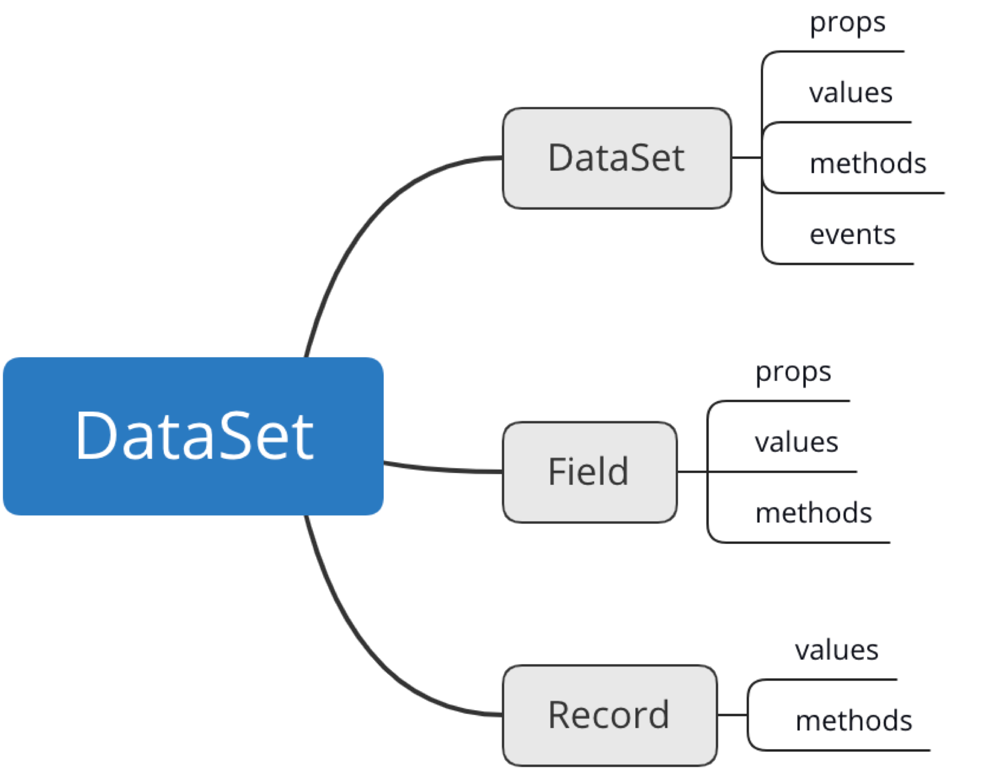

# 5.0前端开发

黄田阳

---
layout: cover
---

# overview

### 📝 **开发流程**

### 🎨 **leaf-ui**

<style>
h3 {
  opacity: 1;
}
</style>

---

# 开发流程

1. 启动项目
2. 添加路由
3. 添加文件
4. 编写文件

---

# 启动项目


## 启动项目（主项目启动）
```shell

## 在开发模式下,可以执行如下命令可以跳过puppeteer安装过程中下载Chromium
$ export PUPPETEER_SKIP_CHROMIUM_DOWNLOAD=1 #macos/linux
# set PUPPETEER_SKIP_CHROMIUM_DOWNLOAD=1 #windows

# yarn install
yarn --registry http://hel.hand-china.com/nexus/content/groups/npm/

# 编译第三方模块
yarn build:dll
# 编译依赖的packages模块
lerna run transpile

# 启动
yarn start

```

---

## 启动项目（子模块单独启动）

```shell

## 在开发模式下,可以执行如下命令可以跳过puppeteer安装过程中下载Chromium
$ export PUPPETEER_SKIP_CHROMIUM_DOWNLOAD=1 #macos/linux
# set PUPPETEER_SKIP_CHROMIUM_DOWNLOAD=1 #windows

# yarn install
yarn --registry http://hel.hand-china.com/nexus/content/groups/npm/

# 编译第三方模块
yarn build:dll

# 编译依赖的packages模块
lerna run transpile

# 打开terminal至子模块路径
cd packages/xxx

# 启动
yarn start

```

---

# 创建路由

在模块下config/router.js

```javascript
{
   path: "/private/hpfm/config",
   key: "/private/hpfm/config",
   authorized: true,
   component: "Config"
 },
```

---
layout: cover
---

# 对应path下创建文件

---

# 用leaf-ui开发

## dataSet

DataSet 可以理解为具有保存数据和部分行为的数据仓库，其余组件可理解为基于数据展示成行为的容器。



<style>
img {
  width: 400px;
}
</style>

---
layout: cover
---

## Form, Table

---
